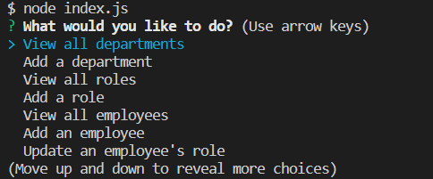

# Employee Database Management

## Table of Contents
  * [Description](#description)
  * [Installation](#installation)
  * [Usage](#usage)
  * [Technology](#technology)
  * [Contribution](#contribute)
  * [Future Development](#future-development)
  * [Questions](#questions)

## Description
A command line application to create a database to keep track of a company's employees, departments and roles.

To see how the application works, click [HERE](https://drive.google.com/file/d/1UaUJeHKTKpf4GakXoOQvEeXDMokx2PtA/view) for a demo video.

## Installation
To install:
  - Click on the green "Code" button to clone or download to your folder 
  - To install dependancies needed, navigate to the main directory and run the following command: `npm i`

## Usage
To start the application, run `node index.js` in the command line. 

## Technology
  * JavaScript
  * Node.js
  * Inquirer
  * MySQL2

## Contribution
No other contributors at the moment. If you'd like to contribute, feel free to contact me.

## Future Development
  * Update employee managers
  * View employees by manager
  * View employees by department
  * Delete employees, roles, and departments
  * View a combined salaries of all employees within a department

## Questions
Have any questions? Please feel free to reach out!  
GitHub: https://github.com/ValPal1320  
Email: valgonzalez13@yahoo.com